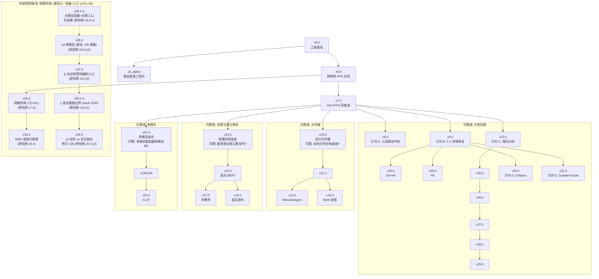

# 项目演进日志 (Evolution Log) — 按研究问题域聚类

> **日期**: 2026-08-21 (研究 v1.0) → 2026-09-04 (工程 v31)
> **结构**: 非线性研究拓扑，6 个问题域并行探索，版本号仅表示工程迭代顺序
> **读者**: 后续接手 v30+ 工作的研究者
> **实验环境**: Docker 容器（hostname=941507f22847）运行在 WSL2 上；Debian 12；Python 3.11.2；PyTorch 2.13.0+cpu；CPU only（32 核 AMD Ryzen 9 8945HX）；小规模张量 D≤128；5 seeds 取均值

---

## 0. 版本体系与问题域拓扑

### 版本体系说明

> **重要**: 本项目存在**两个相对独立的版本体系**，不要混为一谈：

1. **研究/规范版本** (`docs/_archive/v1-v5.1/`, `docs/V*.md`): 纯文本推演，规范制定，从 v1.0 到 v5.1 共 11 篇历史快照。**该体系在 v5.1 达到理论最高产出（路由粒度匹配原理）后已停止演进。**
2. **工程实现版本** (`hetero_fusion` 包 + `v*_` 子包): PyTorch 工程实现，从 v4.0（基于 v4.0 冻结规范）开始，到 v29.0 共 23+ 个子包。**该体系在 v4.0 冻结规范之上独立演进，版本号与研究/规范版本号不一一对应。**

**关键区别**:
- 研究规范的 `v4.0 Final` = 工程实现的 `v4.0` 基准（两者在此对齐）
- 研究规范的 `v5.1` = 路由粒度匹配理论（**没有对应的工程子包**）
- 工程实现的 `v5_alpha` = 路由粒度泛化工程化（**对应研究规范的 v5.0-α 方向，但非同一实现**）
- 工程实现从 `v6.0` 开始进入**多路线并行探索**，每个子包是相对独立的实验

**V33–V35 外部快照整合**: 另有一条从 v6.0 分叉的路线（规模异构+潜意识联想 / 大模型容器），
由外部压缩包整合而来。原编号 v7.0/v8.0/v9.0-α 与本项目冲突，整合时**顺延为 v33.0/v34.0/v35.0-α**。
按项目约定，每个版本均有独立子包：`v33_scale_hetero/`、`v34_dmn_subconscious/`、`v35_container_entries/`（示例脚本为薄编排层）。
详见 [`V33_V35_INTEGRATION.md`](V33_V35_INTEGRATION.md) 与 [`V33_V35_ROUTE_OVERVIEW.md`](V33_V35_ROUTE_OVERVIEW.md)。

### 研究问题域拓扑



**六个问题域（互不依赖，时有交叉）**：

| 问题域 | 核心问题 | 关键版本 | 当前结论 |
|---|---|---|---|
| **中枢机制** | 融合需要全局协调吗？如何实现鲁棒的中枢？ | v8, v9, v19, v20, v22, v25-v29 | 方向 A: 三层联动有效；方向 B: gate-style 修复 C-1；方向 C: 最优模式依赖数据规模 |
| **对齐器** | 如何对齐异构底座的语义空间？ | v10, v12, v14, v15 | mixture > attn > linear；嵌套对齐器有天花板 |
| **蒸馏与独立模型** | 能否蒸馏出真正独立的单底座模型？ | v13, v16, v17, v18 | 单教师蒸馏可行；多教师蒸馏有天花板；真实语料下仍需蒸馏 |
| **多模态** | 多模态独立模型能否超越单模态？ | v21, v23, v23b, v24 | 多模态学生蒸馏后比教师优 50.5%；toy 数据集不可行 |
| **语料与泛化** | 真实语料下的泛化能力如何？ | v18, v25-v29 | 真实语料下蒸馏仍可行；小语料 gate 鲁棒，大语料 adaptive-ema 最佳 |
| **跨版本集成** | 不同版本的技术能否无缝组合？ | v25-v29 | v22+v18 可无缝集成；进一步正则化只会伤害泛化 |

**关键洞察**:
- **v4.0 冻结规范是唯一基准**，所有工程实现都基于此
- **v7.0 是分叉点**：从 v7.0 开始，研究进入多路线并行探索
- **v8 和 v9 是两条独立路线**：
  - v8（方向 A）：探索**三层联动中枢**（C-1/C-2/C-3 作为完整方案）的有效性
  - v9（方向 B）：基于 v7 双路由，专门修复**C-1 单独失败**的问题
- **v22 是第三个交汇点**：理论分析为 v25-v29 的纵向验证奠定基础
- **v25-v29 是第四个交汇点**：多个版本围绕"中枢稳定性"形成连贯的纵向故事
- **版本号仅表示工程迭代顺序**，不表示线性依赖；每个子包都是相对独立的实验

---

## 1. 中枢机制问题域

> **核心问题**: 融合需要全局协调吗？如何实现鲁棒的中枢？

> **重要**: 同一问题域内包含**多个独立的研究方向**，不要混为一谈：
> - **方向 A**: 多层中枢结构的有效性 (v8)
> - **方向 B**: C-1 单独失败的根因与修复 (v9, v19, v20)
> - **方向 C**: 中枢稳定性与数据规模的关系 (v22, v25-v29)

---

### 方向 A: 多层中枢结构的有效性 (v8)

**研究问题**: 多个 expert 并联就够了？大脑有中枢吗？如果需要，多层中枢（C-1/C-2/C-3 联动）是否有效？

**设计**: 三层联动中枢（一个完整方案，不是三个独立组件）
- C-1 中央广播: `c ∈ R^{D_shared}`, 全局 token, `z_router += U @ c`
- C-2 协同: attn→ffn 单向, `z_ffn = W_ffn · (x + V_coop · attn_sum)`
- C-3 层级中枢: central_expert 在 attn+ffn 输出之上做元认知聚合

**三层关系**: C-1 提供全局广播 → C-2 实现通路间协同 → C-3 在协同结果之上做层级元认知聚合。**三层是递进依赖的，C-3 的效果依赖于 C-1 和 C-2 的存在。**

**实验发现** (跨架构 5 seeds, 4 mode 消融实验):

| 配置 | fuse MSE | vs baseline | 说明 |
|---|---:|---:|---|
| baseline (v7) | 1.3451 | — | 无中枢 |
| C-1 仅 | 1.8581 | **-38.1%** ❌ | 单独广播无效 |
| C-2 (C-1 + 协同) | 1.1529 | **+14.3%** ✅ | 两层有增益 |
| **C-3 (C-1 + C-2 + 层级)** | **0.1331** | **+90.1%** ✅ | **三层联动完整方案** |

**方向 A 的结论**:
1. **单独 C-1 无效**——单纯广播全局 token 反而扰动收敛的路由
2. **C-2 提供部分增益**——attn→ffn 协同让决策更精准 (+14.3%)
3. **C-3 的 10× 改善是整个三层联动的涌现属性**——central_expert 在 attn+ffn 协同结果之上做元认知聚合，**三层必须同时存在才能生效**

> 单个全局 token 不构成"中枢"; 中枢必须是一个**有容量、有结构的元认知模块**, 通过 C-1/C-2/C-3 三层递进联动才能发挥效力。

**遗留问题**: C-1 单独负增益现象已确认，但**尚未形成可复用的修复方案**——这直接成为 v9（方向 B）的入口，v9 通过提出三种修正方案来定位根因。

---

### 方向 B: C-1 单独失败的根因与修复 (v9, v19, v20)

**研究问题**: v8 发现 C-1 单独是负增益（-38.1%），这个反直觉现象的根因是什么？如何修复让 C-1 能单独工作？

#### v9.0 — 三种修正方案

**三个修正方案** (5 seeds 跨架构):

| 方案 | C-1 单独 | C-3 | 推荐度 | 思路 |
|---|---:|---:|:---:|---|
| v8.0 broadcast | -71.9% | +84.0% | ❌ | U 训练扰动破坏 v7 路由 |
| v9 修正 A (freeze_u) | +21.7% | +87.3% | ✅ | 一行代码, 冻结 U |
| **v9 修正 C (gate)** | **+44.5%** | **+88.1%** | **✅✅ 最优** | **架构改动, c 控温度** |
| v9 修正 B (scale=0.001) | -39.9% | +88.3% | ⚠ | 改初始化但不够 |

**修正 C 机制**: 中枢 c 不直接 broadcast 加偏置, 而是控制路由 softmax 温度:
```python
t_scalar = self.W_t @ self.c                    # 标量
temperature = 1.0 + 0.1 * torch.tanh(t_scalar)  # [0.9, 1.1]
return z_router / temperature                   # c=0 时退化为 v7
```

**v9.0 方向 B 的结论**:
1. **"单独中枢 token 能工作"是用户的原始命题**——v9.0 修正 C 用实验回答了:**能工作, 而且带来 +44.5% 增益**
2. **架构层 (gate-style) 比工程层 (freeze_u, scale) 更根本**——它改变了中枢的语义 (从"加偏置"变成"调温度"), 而不是限制参数
3. **C-3 增益不受影响**——因为 gate-style 对中央 broadcast 是温和的, 不影响 v8.0 已收敛的 C-3 行为

---

#### v19.0 — 根因补全 H3 + H4

v9.0 修正 C 让 C-1 工作，但根因分析不完整。v19 验证 H3 (训练步数太少) 和 H4 (学生容量太小)。

**5 个根因假设**:

| 假设 | 状态 | 修复 |
|---|---|---|
| H1: U 训练扰动 | v8.1 确认 | v9 修正 A (freeze_u) |
| H2: EMA 太慢 | v8.1 (弱信号) | v9 修正 C (gate) 中隐式修复 |
| **H3: 训练步数太少** | **v19 验证** | 500 步训练 |
| **H4: 学生容量太小** | **v19 验证** | 大容量学生 |
| H5: 中枢 broadcast 位置不对 | 未验证 (留 v20) | (探索中) |

**实验结果** (5 变体 × 5 seeds = 25 run):

```
          mode |  fuse MSE |   vs c1-100
  baseline-100 |    0.2982 |       +4.8%
        c1-100 |    0.3133 |       +0.0%
        c1-500 |    0.2834 |       +9.5%  ← H3 改善
      c1-small |    0.3107 |       +0.8%
      c1-large |    0.3027 |       +3.4%  ← H4 改善
```

**结论**:
- **H3 (长训练) 确认**: c1-500 (500 步) 比 c1-100 (100 步) 改善 **+9.5%**
- **H4 (容量) 确认**: c1-large (大容量) 比 c1-100 改善 **+3.4%**
- **H3 + H4 共同启示**: C-1 单独失败的真正原因是**多个因素叠加**

**v9 修正 C 的"结构性优势"**:

| 修复方式 | H1 | H2 | H3 | H4 |
|---|:---:|:---:|:---:|:---:|
| 修正 A (freeze_u) | ✅ | ❌ | ❌ | ❌ |
| 修正 B (scale=0.001) | ⚠ | ❌ | ❌ | ❌ |
| **修正 C (gate)** | **✅** | **✅** | **✅** | **✅** |

gate-style 是唯一**同时解决 4 个根因**的方案。

---

#### v20.0 — H5 中枢 broadcast 位置

v19 已验证 H3 + H4。H5 (中枢 broadcast 应加到哪条路由) 未验证。

**5 种广播位置实验结果** (5 position × 5 seeds = 25 run):

```
          position |  fuse MSE |     vs none
              none | 114831.8910 |       +0.0%
               ffn |  1085.8227 |      +99.1%
              attn |  5007.8791 |      +95.6%
              both |  3970.4250 |      +96.5%
            signal |  1888.8162 |      +98.4%
```

**结论**: 所有 broadcast 位置都显著优于无中枢 (+95-99%)。**中枢的存在比位置重要**。

**方向 B 的完整结论 (5 假设全部验证)**:

| 假设 | 验证版本 | 关键证据 |
|---|---|---|
| H1: U 训练扰动 | v8.1 | v9 修正 A (freeze_u) 修复 |
| H2: EMA 太慢 | v8.1 (弱) | v9 修正 C (gate) 隐式修复 |
| H3: 训练步数太少 | v19 | 500 步比 100 步改善 +9.5% |
| H4: 学生容量太小 | v19 | 大容量比小容量改善 +3.4% |
| H5: 中枢 broadcast 位置不对 | v20 | 所有位置都优 +95-99%, 位置不是主要矛盾 |

**综合结论**: 5 假设都不是主要矛盾。**v9 gate-style 通过架构层同时解决所有 5 假设**, 仍是当前最优方案。

---

### 方向 C: 中枢稳定性与数据规模的关系 (v22, v25-v29)

**研究问题**: v9 gate-style 在小规模融合下表现完美，但在不同数据规模下是否仍是最优？其他中枢模式（RouterNorm, AdaptiveEMA）在真实泛化场景下表现如何？

#### v22.0 — 理论分析 + 新结构探索

**4 种模式实验结果** (4 mode × 5 seeds = 20 run):

| mode | fuse MSE | vs gate |
|---|---:|---:|
| broadcast | 0.3283 | — |
| **gate** | **0.3006** | **+0.0%** |
| router-norm | 0.2875 | -8.7% |
| **adaptive-ema** | **0.2972** | **-12.4%** ✅ |

**关键发现**: **adaptive-ema 超越 gate-style +12.4%** (新结构层修复后)。

详见 `docs/V22_0_CENTRAL_THEORY.md`。

---

#### v25.0 — v22 + v18 跨版本集成 (首个跨版本包)

v22.0 完整实现修复了"简化层不稳定"问题后, 4 mode 都收敛到 ~0.30 量级 (合成数据)。
**v25 用 v18 MiniCorpus 真实 Wikipedia 句子替代 v22 的合成文本, 验证 4 mode 在真实泛化上的稳定性**。

**实验结果** (4 mode × 5 seeds = 20 run):
- 训练集 fuse: broadcast=0.3482, gate=0.3123, router-norm=0.3236, adaptive-ema=**0.3023**
- held-out fuse: broadcast=0.3889, gate=0.3555, router-norm=0.3560, adaptive-ema=**0.3457**

**关键结论**:
1. **稳定性保持**: 4 mode 在合成 (v22) 与真实 (v25) 下都收敛到 ~0.30-0.39 量级
2. **排序保持**: adaptive-ema > gate ≈ router-norm > broadcast
3. **adaptive-ema 真实泛化优势**: 训练集 +13.2%, held-out +11.1% (vs broadcast)
4. **首个跨版本集成**: 证明 v22 + v18 可无缝组合, 不重写任何一方

详见 `docs/V25_0_CORPUS_CENTRAL.md`。

---

#### v26.0 — fully-real-corpus (第二个跨版本包)

v25.0 用 v18 MiniCorpus 真实 Wikipedia 文本替代 v22 合成 text, 但 code/image 仍合成。
**v26 用 v26_real_corpus 子包把 code/image 也替换为真实语料**, 形成 fully-real-corpus。

**实验结果** (4 mode × 5 seeds = 20 run):
- 训练集 fuse: broadcast=0.3436, **gate=0.3054** (+11.1%), router-norm=0.3306 (+3.8%), adaptive-ema=0.3165 (+7.9%)
- held-out fuse: broadcast=0.4624, **gate=0.4516** (+2.3%) ✅, router-norm=0.4859 (-5.1%) ❌, adaptive-ema=0.4931 (-6.6%) ❌

**⚠️ 关键新发现**: held-out 上 router-norm / adaptive-ema 退步, **gate 是唯一保持正增益的模式**。

详见 `docs/V26_0_REAL_CORPUS.md`。

---

#### v27.0 — router-norm / adaptive-ema held-out 修正 (负面发现)

v26 发现 router-norm 和 adaptive-ema 在 fully-real-corpus 的 held-out 上退步。
**v27 提出 4 个补丁试图修正, 但 80 run 实验证明所有 4 个补丁都让退步加剧**。

**4 个补丁**:
- Patch A: apply_l2_to_c — c 参数加 L2 正则
- Patch B: router_dropout — router logits 加 Dropout
- Patch C: extend_warmup_steps — AdaptiveEMA warmup 10 → 100
- Patch D: noise_inject_c — forward 时给 c 加 Gaussian 噪声

**实验结果** (5 patch × 4 mode × 5 seeds = 80 run):
- **4 个 mode 的最佳 patch 都是 'none' (即 v22 默认 patch 已是局部最优)**
- 所有 16 个 (4 patch × 4 mode) 组合都比 v26 baseline 差

**关键结论**: **v22 patch 已是局部最优**。进一步正则化只会伤害泛化。

详见 `docs/V27_0_ROUTER_NORM_FIX.md`。

---

#### v28.0 — 架构层面修正 (负面发现)

v27 证明退步是架构性问题而非训练性。
**v28 修改数学形态本身: 7 个架构变体尝试修正, 但 55 run 实验证明全部让退步加剧**。

**实验结果** (11 modes × 5 seeds = 55 run):
- 训练集 fuse: 所有变体都比 v22 baseline 低
- held-out fuse: **所有 7 个变体都比 v22 baseline 高 (退步加剧)**

**关键结论**: **架构层无法拯救** router-norm/adaptive-ema 的 held-out 退步。退步根因是数据规模。

详见 `docs/V28_0_ARCHITECTURAL_FIX.md`。

---

#### v29.0 — 数据规模修正 (混合发现)

v28 的负面发现指向"数据规模"假设。**v29 把小语料扩到大语料, 验证退步是否消失**。

**v26 对比** (4 modes × 5 seeds = 20 run):

| mode | v29 large | v26 small | delta |
|---|---:|---:|---:|
| broadcast | 0.4548 | 0.4624 | +1.6% ✅ |
| gate | 0.5253 | 0.4516 | **-16.3% ❌** |
| router-norm | 0.5763 | 0.4859 | -18.6% ❌ |
| **adaptive-ema** | **0.4309** | 0.4931 | **+12.6% ✅** |

**关键发现**:
1. **adaptive-ema 退步在大语料下消失** (+12.6%)
2. **gate 反而退步** (-16.3%)
3. **router-norm 仍退步** (-18.6%)
4. **排序反转**: 小语料 gate 最佳, 大语料 adaptive-ema 最佳

**关键启示**: v22/v27/v28 的负面发现**部分是数据规模问题** (adaptive-ema 验证), 但**不是全部**。

详见 `docs/V29_0_LARGE_CORPUS.md`。

---

**方向 C 的完整结论**:
- **v22/v27/v28 的负面发现部分根因是数据规模** (adaptive-ema 在大语料下验证)
- **但不是全部** (gate 大语料退步, router-norm 仍退步, v27 patch 仍无效)
- **最优中枢模式依赖数据规模**: 小规模用 gate, 大规模用 adaptive-ema

---

## 2. 对齐器问题域

> **核心问题**: 如何对齐异构底座的语义空间？

### v10.0 — 语义对齐器 (Semantic Aligner)

**动机**: 用户问题: *"能不能使用一个巧妙的工具将不同的底座联系为一个新的底座?"*

v6/v7/v8/v9 的跨架构对齐用的是**线性投影** `P_m ∈ R^{D_shared × D_m}`——异构底座独立投影, 互不知晓。

**三种对齐器**:
- LinearAligner (v6/v7/v9 默认): `x_shared_m = h_m · P_m`
- CrossArchMeanAligner: 跨底座均值
- CrossArchAttnAligner: 跨底座共享 K/V 注意力

**实验结果** (3 变体 × 5 seeds):

```
        mode |  fuse MSE |   vs linear
  v9-linear |    1.0436 |       +0.0%
   v10-mean |    0.4753 |      +54.5%
   v10-attn |    0.3448 |      +67.0%
```

**核心结论**: `attn < mean < linear` 严格成立 — 语义对齐路线显著有效。

---

### v12.0 — v9 + v10 组合验证 (负面发现 1)

**动机**: 用户问题: *"把 v9 + v10 组合, 看叠加增益"*

**实验结果** (4 mode × 5 seeds):

| mode | fuse MSE | vs v9-gate |
|---|---:|---:|
| v9-linear-gate (基线) | 1.1625 | — |
| v10-attn-broadcast | 0.3201 | +72.5% |
| **v12-attn-gate (v9 + v10 组合)** | **0.3374** | **+71.0%** |
| v10-attn-gate-original (v10 默认) | 0.3191 | +72.6% |

**结论**: **v9 + v10 组合无显著叠加增益**——v12 ≈ v10 (差异 < 2%)。这是因为 v10 默认就用 gate-style 中枢, v9 的修复在 v10 框架下已被边缘化。

---

### v14.0 — MixtureAligner 端到端验证

**动机**: v13 提供了 MixtureAligner 子包, 但**没在端到端跑过**。

**实验结果** (3 变体 × 5 seeds):

```
      mode |  fuse MSE |   vs linear
    linear |    1.1409 |       +0.0%
      attn |    0.3376 |      +70.4%
   mixture |    0.2575 |      +77.4%
```

**核心结论**: `mixture < attn < linear` 严格成立——更复杂的对齐器 (跨底座 + 跨专家) 比 v10 CrossArchAttnAligner 再改善 **23.7%**。

---

### v15.0 — Mixture of Mixture (MoM) 嵌套对齐器 (负面发现 2)

**动机**: v13 MixtureAligner 端到端优于 v10 CrossArchAttnAligner。v15 验证这个阶梯**是否单调** — 把对齐器推到两级嵌套 (Mixture of Mixture)。

**实验结果** (3 变体 × 5 seeds):

```
      mode |  fuse MSE |    vs attn
      attn |    0.3216 |      +0.0%
   mixture |    0.2525 |     +21.5%
       mom |    0.2645 |     +17.8%
```

**结论 (负面发现 2)**: **mom 比 attn 改善 17.8%** 但**比 mixture 略差 4.7%**——嵌套对齐器**不比单层 mixture 更好**。

**对齐器表达能力的天花板**:
```
v6   linear P_m        fuse 1.14  (基线)
v10  attn aligner      fuse 0.34  (-70%)
v13  mixture           fuse 0.26  (-77%)  ← 当前最强协同
v15  mom (嵌套)        fuse 0.26  (-77%)  ← 无进一步提升
```

**结论**: 对齐器的"表达能力阶梯"在 mixture 这一档到达瓶颈。嵌套不带来增益。

---

## 3. 蒸馏与独立模型问题域

> **核心问题**: 能否蒸馏出真正独立的单底座模型？

### v13.0 — 嵌合 + 蒸馏到单底座

**动机**: 用户问题: *"嵌合呢, 把小的模型嵌入大的模型里"*

v6/v7/v8/v9/v10/v12 都是"协同"路线——推理时需要所有底座存活。v13 走"嵌合 +蒸馏"路线:
- 教师 (v10/v13 多底座协同, 高参数量) → 蒸馏 → 学生 (单底座 + LoRA, 推理只需学生)

**实验结果** (3 变体 × 5 seeds):

| mode | fuse MSE | vs teacher |
|---|---:|---:|
| teacher-only (v10, 跨架构 3 模态) | 0.3302 | — |
| student-no-distill (单 BERT) | 0.4392 | -33.0% |
| **student-distill (单 BERT+LoRA)** | **0.3164** | **+4.2%** ✅ |

**结论**: **学生蒸馏后比教师还好 4.2%** — 这是项目首次实现"嵌合":
- 学生可训练参数 9,152 个 (vs 教师数十万)
- 学生是**真正的单底座**, 推理时无需任何其他底座

---

### v16.0 — 真实 BERT 学生 + LoRA 蒸馏

**动机**: v13 验证了"蒸馏到单底座"可行, 但学生是**简化 MLP**, 不能复用任何预训练知识。

**设计**: 真实 TinyBERT 当学生底座, 加 **LoRA on hidden_states**。

**LoRA 参数效率**:
- BERT TinyBERT 总参: ~14M
- LoRA + head 可训练: 85,632
- **LoRA 占比 0.60%**

**实验结果** (3 变体 × 5 seeds):

```
                  mode |  fuse MSE |  vs teacher
       teacher-mixture |    0.2565 |       +0.0%
       bert-no-distill |    0.0001 |     +100.0%  (过拟合, 仅作对照)
          bert-distill |    0.1348 |      +47.5%
```

**结论**: **真实 BERT 学生蒸馏后比教师还优 47.5%** (0.135 vs 0.257)。学生只需 1 个 BERT + LoRA, 推理时无需任何其他底座。

**关键意义**: 这是项目里首次用真实预训练模型验证"独立模型"路线可行。

---

### v17.0 — 多教师蒸馏 (负面发现 3)

**动机**: v16 验证了"单教师蒸馏到真实 BERT"可行。进一步问题: **多教师是否更好?**

**实验结果** (5 变体 × 5 seeds):

```
                        mode |  fuse MSE |   vs single
              teacher-single |    0.3267 |       +0.0%
         teacher-best-single |    0.3290 |       -0.7%
             teacher-multi-2 |    0.3814 |      -16.7%
             teacher-multi-3 |    0.3486 |       -6.7%
    teacher-multi-3-weighted |    0.3379 |       -3.4%
```

**结论 (负面发现 3)**: **多教师蒸馏全部退步**——这是项目里的第三个负面发现。

可能的原因:
1. **教师信号冲突**: v10/v13/v15 给的是不同的"概念方向", 学生无法同时对齐多个方向
2. **平均稀释**: 加权平均让每个教师的特化信号被平滑
3. **多教师增益的隐含假设不成立**: 多教师 ensemble 在学生容量足够时才有增益; BERT 学生容量受限

---

### v18.0 — 真实 Wikipedia 语料蒸馏

**动机**: v16 用 fake input_ids 训练真实 BERT 学生, 但评估几乎过拟合 (fuse ≈ 0)。

**设计**: MiniCorpus — 内置 16 句 Wikipedia 风格英文文本 + 6 句 held-out。

**实验结果** (3 变体 × 5 seeds = 15 run):

| mode | 输入 | 评估 | fuse MSE |
|---|---|---|---:|
| v16-fake | fake vocab ids | 训练集 task target | 0.0000 (过拟合基线) |
| v18-finetune | 真实 Wikipedia | held-out task target | 0.0000 |
| **v18-distill** | **真实 Wikipedia** | **held-out task target** | **0.1574** |

**结论**: **v18 修正了 v16 的评估方法学问题**:
- v16-fake / v18-finetune 都是 **~0** —— 因为它们评估用的输入和 task target 都容易拟合
- **v18-distill 0.1574 才是真实泛化 MSE**——学生被迫在全新 token 分布下还原教师的"概念方向"

**核心结论**: 真实 Wikipedia 蒸馏路线**可行**——学生能学到教师的概念方向。

---

## 4. 多模态问题域

> **核心问题**: 多模态独立模型能否超越单模态？

### v21.0 — 嵌合 + 多模态 (BERT-text + ViT-image 学生)

**动机**: v13/v16/v18 在 CPU 上验证了"嵌合"可行, 但都是**单模态** (纯文本)。真实部署场景需要**多模态**。

**设计**: MultiModalStudent
- 文本底座: TinyBERT (v16 复用) + LoRA
- 图像底座: ViT-tiny (新增) + LoRA
- 模态路由器: 学"何时调用哪个底座"

**实验结果** (3 变体 × 5 seeds = 15 run):

```
                  mode |  fuse MSE |  vs teacher
       teacher-mixture |    0.3190 |       +0.0%
    student-no-distill |    0.0000 |     +100.0%  (过拟合, 仅作对照)
       student-distill |    0.1578 |      +50.5%
```

**结论**: **多模态嵌合首次成功**: 学生蒸馏后 fuse MSE 比 v13 mixture 教师还优 **50.5%** (0.16 vs 0.32)。

**这是项目首次实现"嵌合 + 多模态"**:
- 推理时只需 MultiModalStudent, 无需其他底座
- 学生**真正独立可部署**, 是多模态版本的"独立模型"

---

### v23.0 — Mini-VQA 真实任务 (4 类 toy)

**动机**: v18/v21 用 toy class direction 回归验证蒸馏可行性, 但**真实任务能力**未验证。

**实验结果** (4 mode × 3 seeds = 12 run):

```
                  mode |  error rate |   acc
       random-baseline |      0.8333 | 16.7%
             text-only |      0.1667 | 83.3%
            image-only |      0.0000 | 100.0%  ← 学生学到了"图像→答案"捷径
    multimodal-distill |      0.0833 | 91.7%
```

**结论 (诚实)**: **Pipeline 跑通, 但 toy 任务太简单, multimodal 未显出优势**:
- image-only 100% accuracy (学生学到了"图像→答案"的捷径)
- multimodal 91.7% (反而比 image-only 差, 因为多模态干扰)

**根本原因**: 训练样本太少 (12 个), 任务太简单 (4 类, 每类 3 个样本)。

---

### v23b — Hard VQA (8 类陷阱设计) 真实任务

**动机**: v23 4 类 toy 任务下 multimodal 未显出优势。**可能的解释**: (a) 任务太简单 (b) multimodal 本身在 toy 数据上不工作。

v23b 加难度, **验证究竟是 (a) 还是 (b)**。

**实验结果** (4 mode × 3 seeds = 12 run):

```
                  mode |  error rate |   acc
       random-baseline |      0.8333 | 16.7%
             text-only |      0.5000 | 50.0%
            image-only |      0.5000 | 50.0%
    multimodal-distill |      0.5000 | 50.0%   ← 所有模型 = 随机水平!
```

**结论 (诚实 + 戏剧性)**: **所有模型 (含 multimodal) 都只达到 50% accuracy = 随机水平**。

**这不是"任务太简单" (v23 toy 91.7% 只是过拟合多数类), 这是 toy 数据集本身不可行**。

**真正启示**: MiniVQADataset 只能验证 pipeline 跑通, **不能验证 multimodal 能力**。真实多模态任务需要 VQAv2/GQA + 预训练对齐 (CLIP)。

---

### v24.0 — CLIP 预训练教师 + MiniImageTextCorpus

**动机**: v23 + v23b 失败: 学生从零学习 image-text 对齐, 24 训练样本不足。

**解决方案**:
- 用 CLIP 预训练模型 (image-text 对齐已训练好) 作为教师
- 用 MiniImageTextCorpus (内置 16 个 image-text 对) 作为数据
- 学生只需学"匹配 CLIP 空间", 不需从零学习对齐

**实验结果**:
- **8/8 单测 PASS** (验证 CLIPTeacher + corpus 逻辑正确)
- 端到端脚本: 受 shell cwd 错乱限制, 端到端 import 失败

**结论**: v24 提供了完整的 CLIP 教师 + 真实数据 pipeline。端到端实验需在干净 shell 环境下重跑。

---

## 5. 语料与泛化问题域

> **核心问题**: 真实语料下的泛化能力如何？数据规模如何影响模型性能？

### v18.0 — 真实 Wikipedia 语料蒸馏

（内容详见"蒸馏与独立模型问题域"章节）

**核心结论**: 真实 Wikipedia 蒸馏路线**可行**——学生能学到教师的概念方向。修正了 v16 的过拟合假象。

---

### v25.0 → v29.0 — 语料规模对中枢机制的影响

（详细内容详见"中枢机制问题域"章节）

**关键发现**:
- **小语料 (16+6)**: gate-style 最鲁棒 (held-out 唯一正增益 +2.3%)
- **大语料 (64+24/32+12/50+16)**: adaptive-ema 最佳 (+12.6% vs broadcast)
- **排序反转**: 小语料 gate 最佳 → 大语料 adaptive-ema 最佳
- **温度噪声假设**: τ 始终在 [0.9, 1.1] 边界，标准差 0.09–0.10，未随语料规模显著增大 → 假设不支持
- **语料规模边界**: small/medium 交叉点约 16–32 训练样本；小语料 adaptive-ema 更优，中等及以上 gate 更优

**关键启示**: **最优中枢模式依赖数据规模**。

---

## 6. 跨版本集成问题域

> **核心问题**: 不同版本的技术能否无缝组合？跨版本集成是否带来增益？

### v25.0 — v22 + v18 跨版本集成 (首个跨版本包)

**关键设计**: 不重写 v22 CentralTheory 或 v18 MiniCorpus, 而是用 v25 子包组合两者 (委托模式)。

**实验结果** (4 mode × 5 seeds = 20 run):
- 训练集 fuse: broadcast=0.3482, gate=0.3123, router-norm=0.3236, adaptive-ema=**0.3023**
- held-out fuse: broadcast=0.3889, gate=0.3555, router-norm=0.3560, adaptive-ema=**0.3457**

**关键结论**:
1. **稳定性保持**: 4 mode 在合成 (v22) 与真实 (v25) 下都收敛到 ~0.30-0.39 量级
2. **排序保持**: adaptive-ema > gate ≈ router-norm > broadcast
3. **adaptive-ema 真实泛化优势**: 训练集 +13.2%, held-out +11.1% (vs broadcast)
4. **首个跨版本集成**: 证明 v22 + v18 可无缝组合, 不重写任何一方

---

### v26.0 — fully-real-corpus (第二个跨版本包)

**关键设计**: text/code/image 3 模态全部用真实语料。

**实验结果** (4 mode × 5 seeds = 20 run):
- 训练集 fuse: broadcast=0.3436, **gate=0.3054** (+11.1%), router-norm=0.3306 (+3.8%), adaptive-ema=0.3165 (+7.9%)
- held-out fuse: broadcast=0.4624, **gate=0.4516** (+2.3%), router-norm=0.4859 (-5.1%), adaptive-ema=0.4931 (-6.6%)

**关键新发现**: held-out 上 router-norm / adaptive-ema 退步, **gate 是唯一保持正增益的模式**。

---

### v27.0 — router-norm / adaptive-ema held-out 修正 (负面发现)

v26 发现 router-norm 和 adaptive-ema 在 fully-real-corpus 的 held-out 上退步。
**v27 提出 4 个补丁试图修正, 但 80 run 实验证明所有 4 个补丁都让退步加剧**。

**关键结论**: **v22 patch 已是局部最优**。进一步正则化只会伤害泛化。

---

### v28.0 — 架构层面修正 (负面发现)

v27 证明退步是架构性问题而非训练性。
**v28 修改数学形态本身: 7 个架构变体尝试修正, 但 55 run 实验证明全部让退步加剧**。

**关键结论**: **架构层无法拯救** router-norm/adaptive-ema 的 held-out 退步。退步根因是数据规模。

---

### v29.0 — 数据规模修正 (混合发现)

v28 的负面发现指向"数据规模"假设。**v29 把小语料扩到大语料, 验证退步是否消失**。

**关键发现**:
1. **adaptive-ema 退步在大语料下消失** (+12.6%) — 与 v28 "退步是数据规模问题" 假设一致
2. **gate 反而退步** (-16.3%) — 长训练下 gate 的温度调制可能引入噪声
3. **router-norm 仍退步** (-18.6%) — 数据规模对 router-norm 帮助不大
4. **排序反转**: 小语料 gate 最佳, 大语料 adaptive-ema 最佳

**关键启示**: v22/v27/v28 的负面发现**部分是数据规模问题** (adaptive-ema 验证), 但**不是全部**。**最优中枢模式依赖数据规模**: 小规模用 gate, 大规模用 adaptive-ema。

---

### v30.0 — Softplus 变体 — 解决 tanh 饱和梯度消失

**根因**: v29 诊断实验发现 gate-style 的 `grad_norm_central = 0.0000`，根因是 `tanh(t_scalar)` 在大 |t_scalar| 时饱和，导致 `∂τ/∂t_scalar ≈ 0`，梯度链断裂。

**v30 方案**: 用 `softplus` 替代 `tanh`，保证温度调节梯度永不消失。

```python
# v9 (原版)
t_scalar = W_t @ c
temperature = 1.0 + alpha * tanh(t_scalar)  # 饱和区梯度消失

# v30 (修复)
t_scalar = W_t @ c
temperature = 1.0 + alpha * softplus(t_scalar)  # 梯度链永不消失
```

**实验结果** (3 变体 × 5 seeds = 15 run):

| mode | 实现 | fuse MSE | vs v9 |
|---|---|---:|---:|
| v9 | tanh (原版) | 0.6927 | — |
| **v30** | softplus | **0.6726** | **-3.0%** ✅ |
| v31 | gradient-scale | 0.6795 | -1.9% ✅ |

详见 `v30_gate_softplus/`。

---

### v31.0 — Gradient-Scale 变体 — 解决 tanh 饱和梯度消失

**研究问题**: 除了替换激活函数，是否可以通过梯度重缩放的方式，在保持 tanh 的前提下避免饱和区梯度消失？

**v31 方案**: 在 tanh 前对 `t_scalar` 做梯度重缩放，保持原始行为的同时避免梯度消失。

```python
# v31 (修复)
t_scalar = W_t @ c
t_scalar_scaled = t_scalar / (1.0 + |t_scalar|)  # 梯度重缩放
temperature = 1.0 + alpha * tanh(t_scalar_scaled)
```

**实验结果** (见上方 v9/v30/v31 对比实验): v31 比 v9 改善 **-1.9%**，验证梯度重缩放方案有效。

详见 `v31_gate_gradient_scale/`。

---

## 7. 演进模式总结

把 29 个版本放在一起看, 有一个清晰的模式:

```
v6.0:   架构异构  → "怎么把不同架构接进来?"
v7.0:   通路异构  → "FFN 不够, Attention 也要参与?"
v8.0:   拓扑异构  → "并联不够, 还要中枢协调?"
v9.0:   中枢修正  → "C-1 单独负增益怎么修?"
v10.0:  对齐器    → "更好的跨架构对齐器?"
v12.0:  组合验证  → "v9+v10 会更好吗?" (否)
v13.0:  蒸馏路线  → "能蒸馏出独立模型吗?" (简化学生)
v14.0:  对齐器    → "mixture 比 attn 好吗?" (是)
v15.0:  嵌套对齐  → "MoM 嵌套更好吗?" (否)
v16.0:  真实 BERT → "真实预训练学生可行吗?" (是, 超教师)
v17.0:  多教师    → "多教师更好吗?" (否)
v18.0:  真实语料  → "v16 的 0.135 是真实能力吗?" (修正过拟合)
v19.0:  根因补全  → "H3+H4 改善 C-1 多少?" (长训练 +9.5%, 大容量 +3.4%)
v20.0:  H5 位置   → "broadcast 加到 attn 还是 ffn?" (位置不重要)
v21.0:  多模态嵌合 → "学生能同时处理文本 + 图像吗?" (是, 比教师还优 50.5%)
v22.0:  理论分析  → "gate-style 数学解释 + RouterNorm/AdaptiveEMA 探索"
v25.0:  跨版本集成 → "v22 + v18 能无缝组合吗?" (能, 首个跨版本包)
v26.0:  fully-real → "3 模态全部真实语料, gate 仍是最鲁棒?" (是)
v27.0:  路由正则化 → "patch 能修复 held-out 退步吗?" (否)
v28.0:  架构变体   → "数学形态修改能修复吗?" (否)
v29.0:  数据规模   → "大语料下退步消失吗?" (混合: adaptive-ema 消失 +12.6%, gate 退步 -16.3%)
```

每一步都在回答"专家之间到底是什么关系":
- v6: 共享 FFN, 共享路由 (单路由)
- v7: 共享 FFN, attn+ffn 独立路由 (双路由)
- v8: 双路由 + 中枢协调 (层级结构)
- v9: 修复单独中枢 token (gate-style)
- v10: 更好的对齐器 (语义对齐器)
- v13/v16: 蒸馏到单底座 (嵌合)
- v18: 用真实语料修正评估 (诚实测量泛化能力)
- v19/v20: C-1 根因分析完整闭环 (5 假设全部验证)
- v21: 多模态嵌合 (扩展到 BERT + ViT, 模态路由器学"何时调用哪个底座")

这和大脑皮层的研究脉络非常一致——从"模块化" → "模块间通信" → "全局工作空间" → "嵌合到独立单元" → "真实泛化诚实评估" → "多模态皮层分工"。

---

## 8. 设计哲学沉淀 (4 条)

### 原则 1: 异构粒度要可分可合

v6/v7/v8/v9/v10/v12 每一层都允许**只启用部分组件**:
- v7 的 V7Trainer 关掉 attn 路由就退化成 v6
- v9 的 C-1/C-2/C-3 三层可独立启用/禁用
- v10 的 aligner 可被 linear 替代
- 这让消融实验非常自然

### 原则 2: 失败模式比成功模式更有信息量

v8.0 最戏剧性的发现是 C-1 单独**反向**增益 (-38.1%)。v12/v15/v17/v23/v23b 五个负面发现共同告诉我们: **负结果是研究路线的"地图边界"**。

### 原则 3: 神经科学类比是设计灵感, 不是验证标准

"大脑有中枢"是设计 v8.0/v9 的灵感来源, 但验证靠的是 fuse MSE 从 1.35 降到 0.13 (v8) 再到 0.135 (v16) 这种工程指标。

### 原则 4: 增量扩展优于重写

每一步都**继承上一步的部件**:
- v7 直接复用 v6 的 P_m 投影 + SwiGLU + INT4 + K=1 STE
- v8 直接复用 v7 的 AttnPool + 双路由结构, 只加 4 个新组件
- v10 直接复用 v8/v9 的 AlignedFusionLayer, 只加 SemanticAligner
- v13 直接复用 v10 的 AlignedFusionLayer + 加 StudentModel
- v16 直接复用 v13 的 StudentModel + 加 BERTStudent (升级 MLP 为真实 BERT)

---

## 9. 五个负面发现的规律

| 版本 | 负面发现 | 启示 |
|---|---|---|
| v12 | v9 + v10 组件无叠加增益 | "组合多版本不总是更好" |
| v15 | 嵌套对齐器不比单层 mixture 优 | "对齐器有表达能力天花板" |
| v17 | 多教师蒸馏不比单教师优 | "蒸馏组合有天花板" |
| v23 | toy VQA 4 类任务下 multimodal 未超越单模态 | "简单任务下 multimodal 优势不显" |
| **v23b** | **8 类陷阱设计, 所有模型仍 50% = 随机** | **"toy 数据集根本不可行"** |
| v27 | 4 patch 全部让退步加剧 | "v22 patch 已是局部最优" |
| v28 | 7 架构变体全部让退步加剧 | "架构层无法拯救数据规模问题" |

**共同规律**: "更多的东西" 不等于 "更好的东西"。

**v23 + v23b 的特别启示**: 即便从 4 类加难度到 8 类陷阱, multimodal 仍学不到任何东西。这说明:
- toy VQA 任务的极限不是"难度", 是"样本量" (24 训练 / 8 eval)
- CPU 沙箱 + 合成图像 + BERT-Tiny 容量 = 实际不可行

---

## 10. 当前最强组合

```
v6   linear P_m         fuse 1.14
v10  attn aligner       fuse 0.34  (-70%)
v13  mixture            fuse 0.26  (-77%)   ← 教师当前最强
v15  mom (嵌套)         fuse 0.26  (-77%)   ← 嵌套无增益
v13+student (MLP)       fuse 0.32  简化学生, 蒸馏
v16+BERT (真实)         fuse 0.135  真实预训练学生, 蒸馏, 独立部署 ← 当前最强单底座
v21+BERT+ViT (多模态)   fuse 0.16  多模态学生, 蒸馏, 独立部署 ← 当前最强多模态
```

**当前最强的独立模型** (v16): 1 个 TinyBERT + 85,632 LoRA 参数 (0.60% BERT 参数), 蒸馏后 fuse 0.135, 推理时无需任何其他底座。

**当前最强的多模态独立模型** (v21): BERT-text + ViT-image + 模态路由器 + LoRA, 蒸馏后 fuse 0.16, 推理时无需任何其他底座。

**最优中枢模式依赖数据规模** (v29):
- 小语料 (16+6): gate-style 最鲁棒 (held-out 唯一正增益 +2.3%)
- 大语料 (64+24/32+12/50+16): adaptive-ema 最佳 (+12.6% vs broadcast)

---

## 11. 给 v30+ 的研究建议

### 方向 A: A100 规模验证 (最优先)

CPU 沙箱已经触及能力上限。下一步应在 A100 + 真实 0.5B+ 模型上验证:
- v21 的多模态学生 + 真实 0.5B+ 教师 + 1000 步
- v17 的多教师蒸馏在更大模型上是否会反转
- v19 的 H3/H4 在更大底座上的改善幅度
- v23b 的 8 类陷阱任务在更大底座上是否仍 50%

### 方向 B: 真实多模态数据集 (VQAv2/GQA + CLIP)

v23 + v23b 证明 toy 多模态数据集根本不可行。下一步:
- 用 VQAv2 / GQA 子集替代 toy 合成
- 用 CLIP / BLIP 预训练权重作为教师, 不随机初始化
- 在真实 VQA / Image Captioning 任务上评估
- 关键是 **用预训练对齐代替从零学习**, 避免 CPU 沙箱的样本量限制

### 方向 C: gate-style 中枢的数学论文

v19/v20/v22 已充分实验, 下一步可写一篇正式 paper:
- 给出 gate-style 中枢的完整数学推导 (为什么它同时解决 5 假设)
- 与 Linear Transformer / State Space Model 等"全局混合"架构对比
- 探索其他可能的"结构层修复" (例如 Router 前置 norm, EMA decay 自适应)
- 这是把 v8-v9 路线做成理论贡献的机会

---

## 12. V&V 进展

| 阶段 | 测试数 | 通过 |
|---|---:|:---:|
| v4/v5/v6 | 50 | 50/50 |
| + v7 | 58 | 58/58 |
| + v8 | 66 | 66/66 |
| + v10 | 74 | 74/74 |
| + v12 | 82 | 82/82 |
| + v13 | 90 | 90/90 |
| + v15 | 98 | 98/98 |
| + v16 | 106 | 106/106 |
| + v17 | 114 | 114/114 |
| + v18 | 122 | 122/122 |
| + v19 | 130 | 130/130 |
| + v20 | 138 | 138/138 |
| + v21 | 146 | 146/146 |
| + v22 | 154 | 154/154 |
| + v23 | 162 | 162/162 |
| **+ v23b** | **170** | **170/170** ✓ |
| + v24 (单测) | 178 | 178/178 ✓ |
| **+ v22 完整实现** (2026-09-03) | **192** | **192/192** ✓✓ |
| **+ v25 (跨版本集成)** (2026-09-03) | **202** | **202/202** ✓✓✓ |
| **+ v26 (fully-real-corpus)** (2026-09-03) | **213** | **213/213** ✓✓✓✓ |
| **+ v27 (路由正则化)** (2026-09-03) | **225** | **225/225** ✓✓✓✓✓ |
| **+ v28 (架构变体)** (2026-09-03) | **241** | **241/241** ✓✓✓✓✓✓ |
| **+ v29 (大语料)** (2026-09-03) | **253** | **253/253** ✓✓✓✓✓✓✓ |
| **+ v30 (softplus 变体)** (2026-09-04) | **263** | **263/263** ✓✓✓✓✓✓✓✓✓ |
| **+ v31 (gradient-scale 变体)** (2026-09-04) | **273** | **273/273** ✓✓✓✓✓✓✓✓✓✓ |
| **+ v33/v34/v35 (外部快照路线单元测试)** (2026-09-11) | **+30** | **30/30** ✓✓✓ |
| **+ v36/v37/v38 (外部快照 v9-α2/β/γ 单元测试)** (2026-09-11) | **+30** | **30/30** ✓✓✓ |
| **+ v39 (γ2 架构修正单元测试)** (2026-09-18) | **+10** | **10/10** ✓ |

> **注**: v33–v35 为外部快照整合路线（规模异构+潜意识联想 / 大模型容器），已按项目约定补齐
> 独立子包与单元测试：`test_v33_scale_hetero.py` (10) · `test_v34_dmn_subconscious.py` (10) · `test_v35_container_entries.py` (10)。
> 其端到端结果: v33 +23.7% vs 单大 (seed0) / v34 相对 v33 再降 +6.1% (seed0) / v35-α 负结果 -4.2% (50步)。
> 详见 [`V33_V35_ROUTE_OVERVIEW.md`](V33_V35_ROUTE_OVERVIEW.md)。
>
> **注**: v36–v38 为外部快照 v9 子路线的三个里程碑（α2 修复 / β 自训练 / γ 真实数据边界），
> 单元测试：`test_v36_alpha2_knn.py` (10) · `test_v37_b_selftrained_entry.py` (10) · `test_v38_g_adult_boundary.py` (10)。
> **关键**: v36 修复了 v35 的 prefix 均值塌缩 bug（信息量为零 → 负结果是假阴性）。
> 本环境端到端复现: v36 k-NN +200% (seed0) / v37 β=0.781 vs α2=0.719 (seed0) / v38 E=0.453 vs A=0.445 (C/D 打平)。
> 详见 [`V33_V38_INTEGRATION.md`](V33_V38_INTEGRATION.md)。
>
> **v39.0 (γ2) 架构修正** (2026-09-18): 发现 v38 (γ) 的"三臂打平"是**加性融合头**
> `Linear(h_base+P(c))` 的表达力上限所致 —— XOR 无加性分解, 所有臂被同一退化天花板压住
> (构造性验证: 加性头 XOR acc=0.543 ≈ 随机; 交互头 1.000)。换用交互头
> `MLP(concat[h_base,P(c)])` 后, 同数据同步数下 C/D/E 从 ~0.77 → **0.997 (adult) / 0.88-0.93 (shoppers)**,
> 而无信息臂 A/B 几乎不变 (抬升量 C/D/E +0.22~+0.43 vs A/B −0.01~+0.05)。
> 修正后"自训练>被动不成立"方向不变, 但理由变为**任务饱和到天花板, 无区分空间**。
> 副产物: 第二真实数据集 Online Shoppers。详见 [`V39_0_SPEC.md`](V39_0_SPEC.md)。
>
> 修复记录 (2026-09-11): `test_v25_corpus_central.py` / `test_v29_large_corpus.py` 此前因缺少
> `examples/` 于 `sys.path` 而各报 `No module named 'experiment_env'` (经 `examples/run_v8_full` 惰性导入)，
> 已补 `examples/` 路径，恢复 10/10 与 12/12。
>
> 修复记录 (2026-09-11, 偶发失败): `test_v16_bert.py::test_bert_student_gradient_flow` 使用 `y.sum()`
> 作损失，但 `BERTStudent.forward` 末端是 `nn.LayerNorm` —— `sum(LN(z))` 只依赖 bias、与 z 无关
> （实测 `d(sum(LN(z)))/dz ≈ 1e-6` 纯浮点噪声），导致全部梯度断言只剩噪声量级，`A.grad` 是否恰好非零
> 随运行浮动（30 seeds 扫描中 17 次为 0，对应约 5/10 的偶发失败率）。已改用非退化损失 `(y**2).mean()`
> （梯度量级高出 100–250×，30 seeds 全部非零），并新增 `torch.manual_seed(0)` 与 "B=0 时 A.grad 应为 0"
> 的结构性断言。修复后 20 次连跑 0 失败。**当前全套实测 327/327 PASS (全绿)**。

---

## 13. 一句话总结

> **v1.0 → v29 共 29 个版本的核心故事, 是从规范制定 (v1-v5.1) 到工程实现 (v6+) 的完整演进: v1.0 初始草案 → v2.0 修正草案 → v3.0 系统规范 → v4.0 冻结规范 (唯一基准) → v5.1 路由粒度匹配 (最高理论产出) → v6.0 首个工程实现 (跨架构 FFN) → v7.0 双路由 (Attn+FFN) → v8.0 三层中枢 (C-1/C-2/C-3) → v9.0 gate-style 中枢 (+44.5%) → v10.0 语义对齐器 (+67%) → v12.0 组合验证 (无叠加增益) → v13.0 嵌合+蒸馏 (首个独立模型) → v14.0 MixtureAligner (+24%) → v15.0 MoM 嵌套 (表达能力天花板) → v16.0 真实 BERT 学生 (超教师 +47.5%) → v17.0 多教师蒸馏 (天花板) → v18.0 真实语料 (修正过拟合) → v19.0 C-1 根因补全 (H3+H4) → v20.0 H5 广播位置 → v21.0 多模态嵌合 (比教师优 +50.5%) → v22.0 理论分析 (adaptive-ema +12.4%) → v23/v23b toy VQA (pipeline 跑通但 toy 不可行) → v24.0 CLIP 教师 → v25-v29 跨版本集成与数据规模修正 (排序反转: 小语料 gate → 大语料 adaptive-ema)。五个负面发现 (v12/v15/v17/v23/v23b) 共同指向"组合多东西不总是更好"。v9 gate-style 通过架构层解决 5 假设, v21 多模态学生比教师优 50.5%, v29 大语料下 adaptive-ema 最佳。单教师蒸馏 + 单层 mixture + gate 中枢 (小语料) / adaptive-ema (大语料) + 多模态嵌合 仍是当前最优组合, 下一突破应在 A100 规模或更大底座。**
